# Schéma des flux de données

## Schéma

```mermaid
flowchart LR
    UI[UI Streamlit conseiller] --> API[API FastAPI]

    UI --> FeedbackForm[Formulaire de correction]
    FeedbackForm --> FeedbackPayload[Payload : classe prédite<br/>+ classe corrigée + commentaire]
    FeedbackPayload -->|POST /feedback| API

    UI --> TrainButton[Bouton « Lancer le réentraînement »]
    TrainButton -->|POST /train| API

    UI --> HistoryButton[Bouton « Charger l'historique »]
    HistoryButton -->|GET /history| API

    UI -->|GET /health| API

    API --> Route{Route appelée}

    API --> Startup[Démarrage du service]
    Startup --> Manifest[Lecture model_manifest.json]
    Manifest --> Hash[Vérification SHA-256]
    Hash -->|Valide| Load[Chargement du pipeline actif avec joblib.load]
    Hash -->|Invalide| StartupError[Arrêt du conteneur : artefact invalide]
    Load --> ActiveModel[(Pipeline actif en mémoire)]

    Route -->|GET /health| Health[Contrôle de santé]
    Health --> HealthModel{Pipeline actif chargé ?}
    HealthModel -->|Oui| HealthOK[Réponse 200 : status ok]
    HealthModel -->|Non| HealthKO[Réponse 200 : status degraded]
    HealthOK --> UI
    HealthKO --> UI

    Route -->|POST /predict| PredictionValidation[Validation Pydantic]
    PredictionValidation -->|Payload invalide| Error422[Réponse 422]
    PredictionValidation -->|Payload valide| ModelCheck{Modèle disponible ?}
    ModelCheck -->|Non| Error503[Réponse 503 : modèle indisponible]
    ModelCheck -->|Oui| Preparation[Préparation des features]
    Preparation --> Features[Extraction du département<br/>depuis le code INSEE]
    Features --> ActiveModel
    ActiveModel --> Prediction[Classe prédite<br/>+ probabilités]
    Prediction --> PredictionResponse[Réponse 200]
    PredictionResponse --> UI
    Prediction --> HistoryAppend[Ajout dans l'historique]
    HistoryAppend --> HistoryCSV[(data/historique_inferences.csv)]
    Error422 --> UI
    Error503 --> UI

    Route -->|POST /feedback| FeedbackValidation[Validation Pydantic]
    FeedbackValidation -->|Payload invalide| FeedbackError422[Réponse 422]
    FeedbackValidation -->|Payload valide| FeedbackAppend[Ajout de la correction au CSV]
    FeedbackAppend --> FeedbackCSV[(data/feedback_conseillers.csv)]
    FeedbackAppend --> FeedbackOK[Réponse 200 : total_feedback_rows]
    FeedbackOK --> FeedbackResponse[Confirmation affichée dans l'UI]
    FeedbackResponse --> UI
    FeedbackError422 --> UI

    Route -->|POST /train| Dataset[Lecture du dataset CSV]
    FeedbackCSV -.->|Fusion des corrections| Dataset
    Dataset --> Training[Entraînement du modèle de validation]
    Training --> Compare{f1_macro >= baseline - tolérance ?}

    Compare -->|Non| TrainRejected[Modèle rejeté]
    TrainRejected --> MLflowRejected[Run MLflow rejected<br/>paramètres + métriques]
    TrainRejected --> ActiveUnchanged[Modèle actif inchangé]
    TrainRejected --> TrainRejectedResponse[Résultat du réentraînement]
    TrainRejectedResponse --> UI

    Compare -->|Oui| Retrain[Réentraînement sur toutes les données]
    Retrain --> ModelVersion[Création de la prochaine version locale<br/>v1.1, v1.2, etc.]
    ModelVersion --> Save[Sauvegarde du pipeline Joblib versionné]
    Save --> Metadata[Sauvegarde des métadonnées<br/>et du hash SHA-256]
    Metadata --> ManifestUpdate[Mise à jour atomique du manifeste]
    ManifestUpdate --> ActiveModel
    ManifestUpdate --> MLflowRun[MLflow : paramètres,<br/>métriques et artefact]
    MLflowRun --> Registry[(MLflow Model Registry)]
    Registry --> Champion[Alias champion<br/>version promue]
    ManifestUpdate --> TrainAcceptedResponse[Résultat : statut, métriques<br/>et version du modèle]
    TrainAcceptedResponse --> UI

    Route -->|GET /history| HistoryRead[Lecture de l'historique]
    HistoryCSV -.-> HistoryRead
    HistoryRead --> HistoryFilter[Filtre conseiller_id + limit]
    HistoryFilter --> HistoryOK[Réponse 200 : liste des prédictions]
    HistoryOK --> UI

    API -.-> Logs[(logs/api.log)]
    Route -.-> Logs

    classDef ok fill:#d1fae5,stroke:#16a34a,stroke-width:2px,color:#166534
    classDef error fill:#fee2e2,stroke:#dc2626,stroke-width:2px,color:#991b1b
    classDef process fill:#dbeafe,stroke:#2563eb,stroke-width:2px,color:#1e3a8a
    classDef decision fill:#fef3c7,stroke:#d97706,stroke-width:2px,color:#92400e
    classDef store fill:#f3e8ff,stroke:#7e22ce,stroke-width:2px,color:#581c87
    classDef client fill:#e0f2fe,stroke:#0284c7,stroke-width:2px,color:#075985

    class UI,FeedbackForm,FeedbackPayload,TrainButton,HistoryButton client
    class API,Startup,Manifest,Hash,Load,PredictionValidation,Preparation,Features,Prediction,PredictionResponse,Health,FeedbackValidation,FeedbackAppend,FeedbackResponse,Dataset,Training,Retrain,ModelVersion,Save,Metadata,ManifestUpdate,MLflowRun,Registry,Champion,HistoryRead,HistoryFilter,TrainRejectedResponse,TrainAcceptedResponse process
    class Route,HealthModel,ModelCheck,Compare decision
    class HealthOK,PredictionResponse,FeedbackOK,HistoryOK,TrainAcceptedResponse ok
    class Error422,Error503,FeedbackError422,TrainRejected,StartupError,MLflowRejected error
    class ActiveModel,ActiveUnchanged,HistoryCSV,FeedbackCSV,Logs store
```

## Légende

Au démarrage, l'API lit `models/model_manifest.json`, vérifie le hash SHA-256 de l'artefact actif, puis charge le pipeline versionné avec `joblib.load()`. Ce pipeline reste en mémoire pour les inférences. Pour `/predict`, le payload est validé, puis le pipeline actif produit une classe et les probabilités associées ; chaque prédiction est aussi journalisée dans `data/historique_inferences.csv`. Les erreurs de validation renvoient `422`, tandis qu'un modèle indisponible renvoie `503`. La route `/health` contrôle l'état du pipeline actif.

La route `/feedback` valide la correction d'un conseiller et l'ajoute à `data/feedback_conseillers.csv`. La route `/train` fusionne ce fichier avec le dataset d'entraînement, valide les métriques par rapport à une baseline, puis rejette ou promeut le nouveau modèle. Un modèle accepté reçoit une nouvelle version locale (`v1.1`, `v1.2`, etc.), est sauvegardé avec ses métadonnées et son hash, puis le manifeste est mis à jour. Le pipeline actif en mémoire est remplacé. MLflow conserve l'artefact, crée une nouvelle version dans le Model Registry et déplace l'alias `champion`. Un modèle rejeté reste tracé sans modifier le modèle actif, le manifeste ni le pipeline en mémoire.

La réponse de `/train` distingue la version locale de l'artefact (`artifact_version`) et la version MLflow (`model_version`). La route `/history` relit le fichier d'historique des inférences, filtrable par `conseiller_id` et limité par `limit`, pour permettre au conseiller de consulter ses prédictions passées. Les requêtes, statuts et durées sont tracés dans `logs/api.log`.

- 🟢 **Vert** : réponses nominales `200` (`/health`, `/predict`, `/feedback`, `/train` et `/history`).
- 🔴 **Rouge** : erreurs fonctionnelles ou techniques (`422`, `503` et rejet de promotion).
- 🔵 **Bleu** : étapes de traitement de l'API et du pipeline de données.
- 🟡 **Jaune** : routes ou contrôles conditionnels qui orientent le flux.

---

## CI/CD (GitHub Actions)

```mermaid
flowchart LR
    Push[Push / PR sur main] --> Lint[lint : ruff check + format]
    Lint -->|échec| StopLint[Pipeline bloqué]
    Lint -->|succès| Test[test : pytest hors /train]
    Lint -->|succès| Train[train-validation : pytest /train]

    Test --> Gate{test et train-validation OK ?}
    Train --> Gate
    Gate -->|Non| StopGate[Pipeline bloqué]
    Gate -->|Oui, si push| Build[build-and-push : build images api/ui]
    Build --> GHCR[(GHCR : images taguées SHA/latest/branche)]
    GHCR -->|si push sur main| Deploy[deploy : runner self-hosted]
    Deploy --> Pull[docker compose pull]
    Pull --> Up[docker compose up -d]
    Up --> Stack[(Stack api + mlflow + ui à jour)]

    Stack --> Startup[API au démarrage]
    Startup --> Manifest[Lecture model_manifest.json]
    Manifest --> Hash[Vérification hash SHA-256]
    Hash -->|valide| Active[Chargement du modèle actif en mémoire]
    Hash -->|invalide| StartupError[Arrêt fail-fast]
    Active --> Health[GET /health : statut + version active]

    Admin[Administrateur ou processus autorisé] --> TrainModel[POST /train]
    TrainModel --> Compare[Validation contre la baseline]
    Compare -->|rejet| Rejected[Run MLflow rejected<br/>modèle actif inchangé]
    Compare -->|promotion| Version[Artefact versionné<br/>métadonnées + hash]
    Version --> ManifestUpdate[Mise à jour atomique<br/>model_manifest.json]
    ManifestUpdate --> Active
    Version --> Registry[MLflow Model Registry<br/>nouvelle version + alias champion]

    classDef ok fill:#d1fae5,stroke:#16a34a,stroke-width:2px,color:#166534
    classDef error fill:#fee2e2,stroke:#dc2626,stroke-width:2px,color:#991b1b
    classDef process fill:#dbeafe,stroke:#2563eb,stroke-width:2px,color:#1e3a8a
    classDef decision fill:#fef3c7,stroke:#d97706,stroke-width:2px,color:#92400e
    classDef version fill:#f3e8ff,stroke:#7e22ce,stroke-width:2px,color:#581c87

    class Stack,GHCR,Active,Registry ok
    class StopLint,StopGate,StartupError,Rejected error
    class Lint,Test,Train,Build,Deploy,Pull,Up,Startup,Manifest,Hash,Health,Admin,TrainModel,Version,ManifestUpdate process
    class Gate,Compare decision
```

Le pipeline [`ci.yml`](.github/workflows/ci.yml) enchaîne cinq jobs à chaque `push`/`pull_request` sur `main` (ou déclenchement manuel) :

1. **`lint`** : `ruff check` + `ruff format --check` (config [`ruff.toml`](ruff.toml)). Bloque tout le reste en cas de non-conformité.
2. **`test`** et **`train-validation`** (en parallèle, après `lint`) : tests unitaires de l'API (`pytest -k "not train"`) et validation dédiée du pipeline d'entraînement — promotion vs baseline `f1_macro`, tolérance de dégradation (`pytest -k "train"`).
3. **`build-and-push`** (uniquement sur `push`, après succès des deux jobs de test) : construit et publie les images `api` et `ui` sur GHCR, taguées SHA du commit / `latest` / branche.
4. **`deploy`** (uniquement sur `push` vers `main`) : tourne sur un runner self-hosted installé sur la machine cible, s'authentifie à GHCR puis relance la stack via `docker compose -f docker-compose.prod.yml pull` + `up -d`.

Chaque étape ne s'exécute que si la précédente a réussi, garantissant qu'aucune image non testée ni non lintée n'atteigne la production.

---

*Schéma produit par Romain, 18/09/2026, dans le cadre de la certification Atlas.*
