# Schéma des flux de données

## Schéma

```mermaid
flowchart LR
    Client[Client HTTP] --> API[API FastAPI]
    API --> Route{Route appelée}

    Route -->|GET /health| Health[Contrôle de santé]
    Health --> HealthModel{Modèle chargé ?}
    HealthModel -->|Oui| HealthOK[Réponse 200 : status ok]
    HealthModel -->|Non| HealthKO[Réponse 200 : status degraded]

    Route -->|POST /predict| Validation[Validation Pydantic]
    Validation -->|Payload invalide| Error422[Réponse 422]
    Validation -->|Payload valide| ModelCheck{Modèle disponible ?}
    ModelCheck -->|Non| Error503[Réponse 503 : modèle indisponible]
    ModelCheck -->|Oui| Preparation[Préparation des features]
    Preparation --> Features[Extraction du département<br/>depuis le code INSEE]
    Features --> Pipeline[Pipeline LightGBM]
    Pipeline --> Prediction[Classe prédite<br/>+ probabilités]
    Prediction --> Response200[Réponse 200]
    Prediction --> HistoryAppend[Ajout de la ligne à l'historique]
    HistoryAppend --> HistoryCSV[(data/historique_inferences.csv)]

    Route -->|POST /feedback| FeedbackValidation[Validation Pydantic]
    FeedbackValidation -->|Payload invalide| FeedbackError422[Réponse 422]
    FeedbackValidation -->|Payload valide| FeedbackAppend[Ajout de la ligne au CSV]
    FeedbackAppend --> FeedbackCSV[(data/feedback_conseillers.csv)]
    FeedbackAppend --> FeedbackOK[Réponse 200 : total_feedback_rows]

    Route -->|POST /train| Dataset[Lecture du fichier CSV]
    FeedbackCSV -.->|Fusion des corrections| Dataset
    Dataset --> Training[Entraînement de validation]
    Training --> Compare{f1_macro >= baseline - tolérance ?}
    Compare -->|Non| TrainRejected[Réponse 200 : modèle rejeté]
    Compare -->|Non| MLflowRejected[MLflow : run rejeté<br/>paramètres + métriques]
    Compare -->|Oui| Retrain[Réentraînement sur tout le jeu]
    Retrain --> MLflowRun[MLflow : paramètres + métriques<br/>+ artefact du pipeline]
    MLflowRun --> Registry[(MLflow Model Registry)]
    Registry --> Champion[Alias champion<br/>version promue]
    Retrain --> Save[Sauvegarde du modèle Joblib + baseline]
    Save --> TrainOK[Réponse 200 : modèle entraîné]

    Route -->|GET /history| HistoryRead[Lecture du CSV historique]
    HistoryCSV -.-> HistoryRead
    HistoryRead --> HistoryFilter[Filtre conseiller_id + limit]
    HistoryFilter --> HistoryOK[Réponse 200 : liste des prédictions]

    API -.-> Logs[(logs/api.log)]
    Route -.-> Logs

    classDef ok fill:#d1fae5,stroke:#16a34a,stroke-width:2px,color:#166534
    classDef error fill:#fee2e2,stroke:#dc2626,stroke-width:2px,color:#991b1b
    classDef process fill:#dbeafe,stroke:#2563eb,stroke-width:2px,color:#1e3a8a
    classDef decision fill:#fef3c7,stroke:#d97706,stroke-width:2px,color:#92400e

    class HealthOK,Response200,TrainOK,FeedbackOK,HistoryOK ok
    class Error422,Error503,FeedbackError422,TrainRejected error
    class API,Preparation,Features,Pipeline,Prediction,Dataset,Training,Retrain,Save,MLflowRun,Registry,Champion,MLflowRejected,FeedbackValidation,FeedbackAppend,HistoryAppend,HistoryRead,HistoryFilter process
    class Route,HealthModel,ModelCheck,Compare decision
```

## Légende

Le client HTTP envoie une requête à l'API FastAPI, qui la dirige vers la route demandée. Pour `/predict`, le payload est validé, puis le modèle LightGBM produit une classe et les probabilités associées ; chaque prédiction est aussi journalisée dans `data/historique_inferences.csv`. Les erreurs de validation renvoient `422`, tandis qu'un modèle indisponible renvoie `503`. La route `/health` contrôle l'état du modèle. La route `/feedback` valide la correction d'un conseiller et l'ajoute à `data/feedback_conseillers.csv`. La route `/train` fusionne ce fichier de corrections avec le dataset d'entraînement, valide les métriques par rapport à une baseline (garde-fou anti-régression avec tolérance de dégradation), crée un run MLflow avec les paramètres et les métriques, puis promeut ou rejette le nouveau modèle. Un modèle accepté est enregistré dans le Model Registry et reçoit l'alias `champion`, tandis qu'un modèle rejeté reste tracé sans modifier le modèle servi. La route `/history` relit le fichier d'historique des inférences, filtrable par `conseiller_id` et limité par `limit`, pour permettre au conseiller de consulter ses prédictions passées. Les requêtes, statuts et durées sont tracés dans `logs/api.log`.

- 🟢 **Vert** : réponses nominales `200` (`/health`, `/predict`, `/feedback`, `/train` et `/history`).
- 🔴 **Rouge** : erreurs fonctionnelles ou techniques (`422`, `503` et rejet de promotion).
- 🔵 **Bleu** : étapes de traitement de l'API et du pipeline de données.
- 🟡 **Jaune** : routes ou contrôles conditionnels qui orientent le flux.

---

*Schéma produit par Romain, 18/09/2026, dans le cadre de la certification Atlas.*
