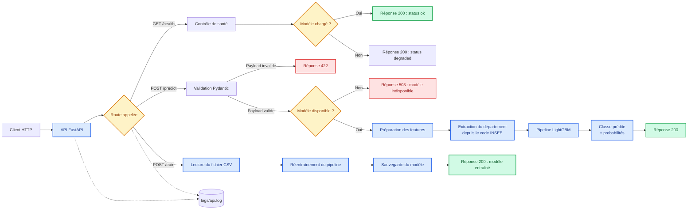

# Schéma des flux de données

## Schéma

## Légende

Le client HTTP envoie une requête à l'API FastAPI, qui la dirige vers la route demandée. Pour `/predict`, le payload est validé, puis le modèle LightGBM produit une classe et les probabilités associées. Les erreurs de validation renvoient `422`, tandis qu'un modèle indisponible renvoie `503`. La route `/health` contrôle l'état du modèle et `/train` permet de réentraîner puis de sauvegarder le pipeline. Les requêtes, statuts et durées sont tracés dans `logs/api.log`.

- 🟢 **Vert** : réponses nominales `200` (`/health`, `/predict` et `/train`).
- 🔴 **Rouge** : erreurs fonctionnelles ou techniques (`422` et `503`).
- 🔵 **Bleu** : étapes de traitement de l'API et du pipeline de données.
- 🟡 **Jaune** : routes ou contrôles conditionnels qui orientent le flux.

---

*Schéma produit par Romain, 18/09/2026, dans le cadre de la certification Atlas.*
